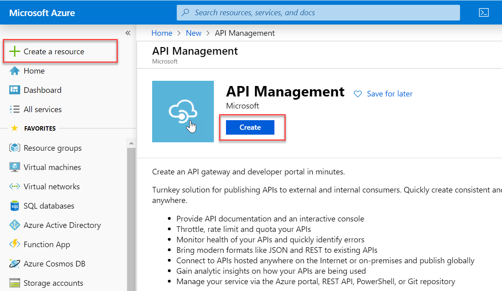
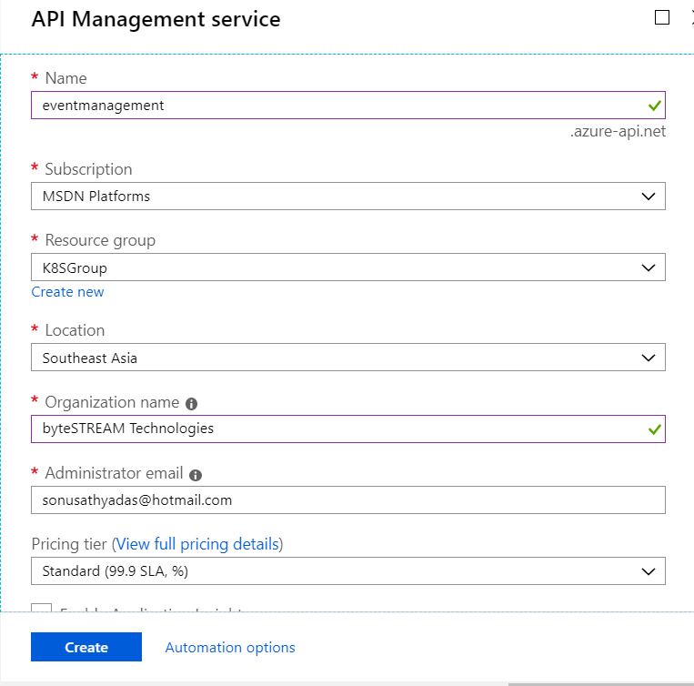

## Configuring API Gateway for Microservices

In the previous chapter, we have successfully deployed the `EventAPI` and `IdentityAPI` services in the AKS cluster on Azure. In this chapter, we will be configuring the API Management Gateway service for your microservices.

#### Prerequisites
+ Azure Subscription

### What is API Management Gateway?
API Management (APIM) is a way to create consistent and modern API gateways for existing back-end services. API Management helps organizations publish APIs to external, partner, and internal developers to unlock the potential of their data and services. You can configure and manage your API's deployed on Azure and non-azure platforms using API gateway. APIM helps you to enable security, endpoint configuration, caching, mocking and response transformation using various policies.

### Components of API Gateway
* Gateway
* Publisher Portal (now Azure Portal)
* Developer Portal

#### Gateway
The API gateway is acts like a proxy that accepts reqeusts from the users and routes the requests to the backend service. The Gateway provides a unique base url for all your API's configured in the gateway. Gateway verifies the client request by validating the JWT tokens, certificates and other credentials. You can configure request throttling for each user or subscription. The gateway also helps you to enable mocking and caching for your services. Request and response can be transformed without making any code changes in the application.
#### Publisher Portal
The Publisher portal helps API developers to import the API schema and package the APIs into products. You can setup the quota and transformation of APIs. You can also get insights of the API and manage the API users and subscriptions. Publisher portal features are now integrated in to Azure portal.
#### Developer Portal
The Developer portal serves as the main web presence for developers. You can read and download the API documentation from the developer portal. Try out an API via the interactive console of developer portal. You can create an account and subscribe to get API keys.

### Policies for API
Policies are a powerful capability of API Management that allow the Azure portal to change the behavior of the API through configuration. Policies are a collection of statements that are executed sequentially on the request or response of an API. Popular statements include format conversion from XML to JSON and call rate limiting to restrict the number of incoming calls from a developer, and many other policies are available. Policy expressions can be used as attribute values or text values in any of the API Management policies, unless the policy specifies otherwise. For a complete list of API Management policies, see [Policy reference](https://docs.microsoft.com/en-us/azure/api-management/api-management-policies).

### Create the API Gateway on Azure Portal
1. Open web browser and navigate to [Azure Portal](https://portal.azure.com).
2. Login to Azure Portal using your valid credentials.
3. Click on `Create a resource` and serarh for `API management`.

4. Specify the API gateway name, subscription, resource group, location, organization name, email and Pricing tier. Click on the `Create` button to create the service. 

It may take 20-30 minutes to complete the creation process. You will get a notification mail when the creation process completes successfully.
5. Once the API gateway is created, open the gateway service. You can find the the Developer portal URL and Gateway URL in the overview page. 

### Configure Event API in Gateway
1. Now, you need to configure the `Event API` and `IdentityAPI` to the gateway. Click on the `API` from the left side under 'API management'.
2. Choose the 'OpenAPI' from the list.

3. Enter the `EventAPI` service swagger documentation url in the 'Open API specification' textbox. You can also change the Display name for the API. 

4. This will add the `Event API` API and its operations in the gateway. 

5. Now, you need to configure the backend policy for the service. Click on the edit icon of the 'Http endpoint' from the backend section.

6.Select 'Http endpoint' radio button and tick the override checkbox. Enter the `Event API` service public IP address in the textbox and click 'Save'.

7. You can see the backend Http endpoint updated in the gateway.

8. You can now test the API. Select the `GetEvents` operation and goto the test view by clicking on the 'Test' link. Click on the 'Send' button to send the request.

9. This will connect to the `EventAPI` service running on the Kubernetes cluster and returns the events list. If the events table is empty it returns an empty array.

### Configuring Inbound and Outbound policies
#### Configure rate limiting 
1. Select 'All Operations' of Event API and click on 'Add policy' in the inbound section.

2. Select the 'Limit call rate' policy by clicking on 'rate-limit-by-key' button.

3. Configure the policy parameters. You can set the number of calls, renewal period, counter key and Increment condition. You can choose counter key as 'subscription key' if you want to enable rate limiting based on subscription key. Also specify the increment condition as 'Successfull requests'. It will count only the successfull requests. 

4. Click on the `Save` to configure the policy.
#### Configure Caching for an operation
1. Select the `GetEvents` operation from the operations list in Event API. Click on 'Add policy' button of the Inbound section. 
2. Choose 'Cache responses' policy by clicking in the 'cache-lookup/store' button.

3. This opens the caching policy basic configuration page. Click on the 'Full' link to specify the additional caching configurations. Specify the 'Cache duration' as 600 for cahing data for 10 minutes. 

4. You can also configure the 'Vary By Param' setting for the caching. Click on the 'Add Header' button to specify the 'Http Header' as 'Accept'.

5. Click on the 'Save' button to save the policy for `GetEvents` operation.

#### Configure SetHeader policy for responses
1. Select 'All operations' for the 'EventAPI' and click on the 'Add Policy' button from the 'Outbound' section.

2. Choose the 'Set Headers' policy.

3. Specify the header name as 'X-Powered-By' and action as 'delete'.

4. Click on 'Save' to save the changes. This will remove the 'X-Powered-By' header from the response.

### Configure Identity API in gateway.
1. You can follow the steps we have used for configuring the 'EventAPI' in gateway. 
2. Select 'API' and click on 'Add API' button.

3. Choose 'OpenAPI' from the list.

4. Specify the 'Identity API' swagger url in the 'OpenAPI specification' text box and change the Display name if required. You need to specify an 'API url suffix' value to differentiate the 'Event API' endpoint and 'Identity API' endpoint.

5. You can see the operation of 'Identity API' in the page.

6. Click on the edit icon of the 'Http endpoint' in the backend section to configure the backend url.

7. Click on the Save to update the changes. 
8. Select the 'Register' method and click on the 'Test' tab.
9. Select the 'Raw' option for request body and provide a sample user information in the json format. Use the sample data given below.
`{
  "id": 0,
  "firstName": "string",
  "lastName": "string",
  "email": "string",
  "password": "string",
  "contactNo": "string"
}`

10. Click on the 'Send' button to call the Register API method. You can see the response as shown below.

11. You have successfully added the Identity API and tested it. You can now configure the policies for the API as required.

### Configure the Products
1. Select 'Products' under 'API management'.
2. Click on the Add button in the products page.

3. Specify the product name and description. Choose 'published' option for publishing the product immediately when it is created. Select the check boxes for 'Requires subscription' and 'Requires approval'.

4. You can now add APIs to the product. Click on the 'Select API' button to choose the API's you want to package in the product. Select the 'Event API' and Identity API' and click on the 'Select' button.

5. Click on the 'Create' button to create the product. 
6. You can now see the product you have created. 

7. Note that the access control is given only to the administrators. To allow developers to subscribe the product, you need to give access to the developer group also. Do not give access to guest users. That allows only signed users to view and subscribe the product using the Developer portal. Click on the product you have created to give access control for developer group.

8. Select Access control and click on the 'Add group' button. This will open a new popup blade to select the groups. Select the developers group and click 'Select' button.

9. You can now see the Access control list is updated for your product.

### Subscribing products using Developer portal
1. Goto the overview page of the gateway and copy the developer portal url to a new browser window.

2. This will open the Developer portal. you can now register as a new user in the portal by clicking the 'Sign up' button.

3. Complete the registration process. Once the registration is completed it will send a validation mail to the given mail address. You need to verify it by clicking the verification link.

4. Once the account is verified you will see the user profile page. This will show the product subscriptions and applications you have.

5. Navigate to the products page. It will list the products published on the gateway.

6. Click on the 'EventManagement' product and subscribe it. It will ask for the confirmation and confirm it.

7. After you have requested for the subscription you will be redirected to the profile page again. There you can see the new subscription with status as 'Requested'.

8. You can now go back to the Azure portal and select the product to view the subscription requests. You can approve or reject the requests.

9. Click on the (...) on the right side of the request. It will give a list of options for approval, cancel, reject and suspend the request. Approve the request by clicking 'Activate subscription'.

10. You can go back to the Developer portal and refresh the profile page. You will be able to see the status changed and the subscription keys for accessing the APIs in the product.

### Test the API's using Developer Portal
1. Click on the API link in the developer portal. Choose the Event API from the list of APIs.

2. This will show the list of operations of the Event API in the console.

3. Select the 'GetEvents' method and click on 'Try it'.

4. You can see a request header with the name 'Ocp-Apim-Subscription-Key' with the subscription key as its value. This header is mandatory whenever you make a request to the API gateway from a client application. Click on the 'Send' button to send the request to the REST service.

5. You can see the response below the send button. 

6. Your microservices are now ready and you can call it from the front end applications. While making calls to the API you need to use the API gateway url and include the 'Ocp-Apim-Subscription-Key' in the request header.

---
Shared by Sonu Sathyadas
[mailto:sonusathyadas@hotmail.com](mailto:sonusathyadas@gmail.com)