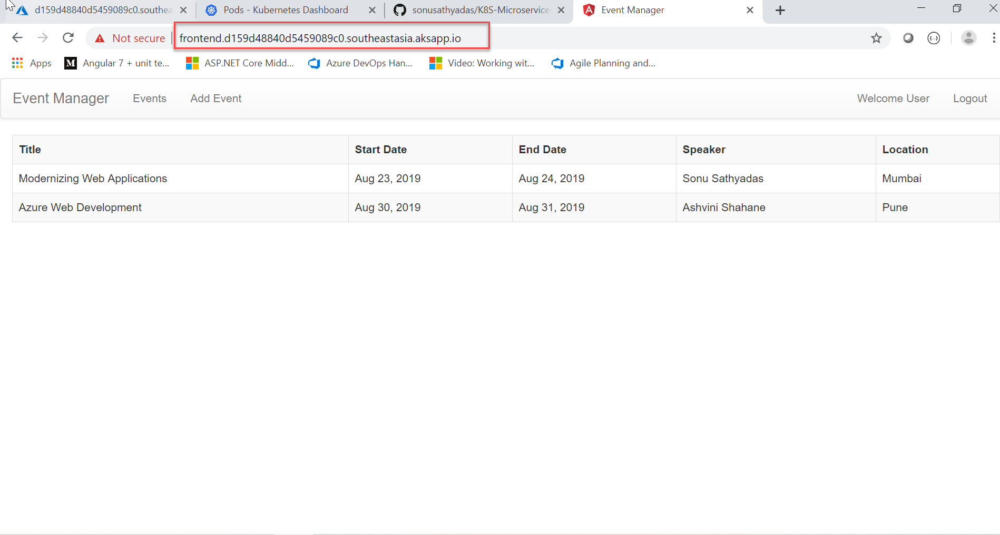

## Deploying frontend for Microservices
In the previous chapters, we have successfully created the AKS clsuter, deployed microservices and successfully configured the API gateway for the services. In this chapter, we will be creating an Angular UI application for our `Event management` application.
#### Prerequisites
+ Angular CLI
+ Docker Desktop
+ Docker Hub account
+ Visual Studio Code

### Build the Angular UI application
1. Clone the `https://github.com/sonusathyadas/K8S-Microservices` repository and open the `EventClient` folder in VS Code. This folder contains the Angular project.
2. Open the `src/app/interceptors/gateway-interceptor.ts` file and update the value for the `apiSubscriptionKey` variable. Copy your product subscription key which you have acquired in the previous chapter. You can see it the `Profile` page of the `Developer Portal`.
    ``` 
    @Injectable({
            providedIn: 'root'
    })
    export class GatewayInterceptor implements HttpInterceptor {
        apiSubscriptionKey:string="<Your product subscription key>";
        constructor() { }
        intercept(req: HttpRequest<any>, next: HttpHandler): Observable<HttpEvent<any>> {
            let newReq= req.clone({
                setHeaders:{
                    "Ocp-Apim-Subscription-Key":this.apiSubscriptionKey
                }
            });
            return next.handle(newReq)
        }
    }
    ```
3. Now, you need to configure the base URLs for calling `Event API` and `Identity API`. To do that, open the `event-service.ts` file from the `src/app/servcies` folder. Update the value for the `API-BASE_URL` variable. You can set the API Gateway URL for your `Event API` servcie. Sample code below:
    ```
    export class EventService {
        private API_BASE_URL:string="https://eventmanagement.azure-api.net";
        constructor(private http: HttpClient) {         
        }
    ```
4. Also, update the base URL for calling `Identity API ` methods. Open the `auth-service.ts` file from the `src/app/services` fodler and update the value for `API_BASE_URL`. Specify the Gateway URL for the `Identity API` service. Sample code below:
    ```
    export class AuthService {
        private API_BASE_URL: string="https://eventmanagement.azure-api.net/auth";
        private loggedIn: boolean = false;
        private subject: BehaviorSubject<boolean>;
    ```
5. You can now run and test the application locally by running the `ng serve -o` command.
6. To build the application run the `ng build --prod` command from the command prompt of the project root folder. This will compile and build the code and copy the build outputs to the `dist` folder.
7. Now, we can dockerize the application. To do so, add a `Dockerfile` to the root folder and copy the following code to it.
    ```
    FROM nginx:latest
    LABEL author="Sonu Sathyadas"
    WORKDIR /usr/share/nginx/html/
    COPY ./dist/eventclient/ ./
    EXPOSE 80
    ```
8. Add a `.dockerignore` file also to the project root folder. Add the `node_modules` to the `.dockerignore` file.
    ```
    node_modules
    ```
9. Now, you can build the docker image of the application. Run the following command to create the image.
    `docker build -t <dockerid>/eventui:latest .`
    `eg: docker build -t azuredeveloper/eventui:latest .`
10. Run and test the application on local Docker.
11. Upload the docker image to the `Docker Hub`. Run the following command.
    `docker push <dockerid>/eventui:latest`
    `eg: docker push azuredeveloper/eventui:latest`

### Deploy `EventUI` frontend application
1. Add a new yaml file with the name `frontend-deploy.yaml` in `k8s-yaml` folder.
2. Add the following code to it.
    ```
    apiVersion: apps/v1
    kind: Deployment
    metadata:
      name: frontend-deploy
    spec:
      replicas: 1
      selector:
        matchLabels:
          app: frontend
      template:
        metadata:
          labels:
            app: frontend
        spec:           
          containers:
          - name: eventui
            image: <event_ui_docker_hub_image>
            resources:
              limits:
                memory: "256Mi"
                cpu: "500m"
            ports:
            - containerPort: 80       
    ```
    * You need to update the `image` attribure value with your `eventui` image name which you have uploaded to your Docker hub. (`eg: azuredeveloper/eventui:latest`).     
3. Run the command to deploy the `EventAPI` instances.
    > $ kubectl apply -f k8s-yaml/frontend-deploy.yaml
    ```
    λ kubectl apply -f k8s-yaml/frontend-deploy.yaml
    deployment.apps "frontend-deploy" created
    ```
4. Check the status of the pods.
    > $ kubectl get pods
    ```
    λ kubectl get pods
    NAME                               READY     STATUS    RESTARTS   AGE
    event-deploy-94b48df8f-94d2x       1/1       Running   3          24m
    event-deploy-94b48df8f-pcc8n       1/1       Running   2          24m
    frontend-deploy-658d57b8d-gw4bh    1/1       Running   0          1m
    identity-deploy-6b7c97b88f-h8q9p   1/1       Running   3          39m
    identity-deploy-6b7c97b88f-zzz5t   1/1       Running   0          39m
    sql-54f6889b4f-9wp6l               1/1       Running   0          1h
    ```
5. Deploy a service that provides access to `frontend` instances. But, we will not create the `frontend` service as a `LoadBalancer` type. The `LoadBalancer` will create a public IP for the service. But we are going to create it as a `ClusterIP` service which does not assigns a public IP. Instead of accessing the frontend through an IP address, you would like to expose the frontend over a hostname. Explore using Kubernetes `Ingress` with `AKS HTTP Application Routing` add-on to achieve this purpose. 
    ##### Ingress resource in Kubernetes
    An `ingress controller` is a piece of software that provides *reverse proxy*, *configurable traffic routing*, and *TLS termination* for Kubernetes services. Kubernetes ingress resources are used to configure the ingress rules and routes for individual Kubernetes services. *Using an ingress controller and ingress rules, a single IP address can be used to route traffic to multiple services in a Kubernetes cluster*.
    
    The **HTTP application routing** add-on makes it easy to access applications that are deployed to your Azure Kubernetes Service (AKS) cluster. As applications are deployed, the solution also creates publicly accessible DNS names for application endpoints. When you enable the add-on, this deploys two components:a Kubernetes Ingress controller and an External-DNS controller.
    **Ingress controller**: The Ingress controller is exposed to the internet by using a Kubernetes service of type LoadBalancer. The Ingress controller watches and implements Kubernetes Ingress resources, which creates routes to application endpoints.
    **External-DNS controller**: Watches for Kubernetes Ingress resources and creates DNS A records in the cluster-specific DNS zone using Azure DNS.

6. Run the following command to enable the `http-application-routing` add-on in your cluster.
    > $ az aks enable-addons -g K8SGroup -n k8scluster --addons http_application_routing
7. Create `frontend-service.yaml` file with the following code.
    ```
    apiVersion: v1
    kind: Service
    metadata:
      name: eventsvc
    spec:
      selector:
        app: event
      ports:
      - port: 80
        targetPort: 80
      type: ClusterIP    
    ```
8. Deploy the service to the cluster using the following command.
    > $ kubectl apply -f k8s-yaml/frontend-service.yaml
    ```
    λ kubectl apply -f k8s-yaml\frontend-service.yaml
    service "frontend" created
    ```
9. List the running services
    > $ kubectl get svc
    ```
    λ kubectl get svc
    NAME          TYPE           CLUSTER-IP     EXTERNAL-IP       PORT(S)          AGE
    eventsvc      LoadBalancer   10.0.71.116    104.215.186.184   80:32093/TCP     46m
    frontend      ClusterIP      10.0.56.8      <none>            80/TCP           1m
    identitysvc   LoadBalancer   10.0.219.127   52.163.85.5       80:32128/TCP     1h
    kubernetes    ClusterIP      10.0.0.1       <none>            443/TCP          7h
    mssql         LoadBalancer   10.0.22.57     23.101.27.45      1433:32544/TCP   2h
    ```
10. Now, you need to deploy your `Ingress` service. The `ingress` deployment file need to be updated with the `hostname` of `DNS Zone` created in the subscription. Run the following command to get the `hostname` of the DNS Zone.
    > $ az aks show -g K8SGroup -n k8scluster --query addonProfiles.httpApplicationRouting.config.HTTPApplicationRoutingZoneName -o table
    ```
    λ az aks show -g K8SGroup -n k8scluster --query addonProfiles.httpApplicationRouting.config.HTTPApplicationRoutingZoneName -o table
    Result
    --------------------------------------------
    569cf974d82046338fbf.southeastasia.aksapp.io
    ```
    You should get back something like 569cf974d82046338fbf.southeastasia.aksapp.io. 
11. Create an ingress deployment file with the name `frontend-ingress.yaml` and and add the following code to it.
    ```
    apiVersion: extensions/v1beta1
    kind: Ingress
    metadata:
      name: frontend
      annotations:
        kubernetes.io/ingress.class: addon-http-application-routing
    spec:
      rules:
      - host: frontend.<CLUSTER_SPECIFIC_DNS_ZONE>
        http:
          paths:
          - backend:
              serviceName: frontend
              servicePort: 80
            path: /
    ```
12. Replace the &lt;CLUSTER_SPECIFIC_DNS_ZONE&gt;  with the DNS zone name you retrieved from the previous command.
13. Deploy the ingress by running the following command.
    > $ kubectl apply -f k8s-yaml/frontend-ingress.yaml
    ```
    λ kubectl apply -f k8s-yaml\frontend-ingress.yaml
    ingress.extensions "frontend" created
    ```
14. List the created ingress.
    > $ kubectl get ingress
    ```
    λ kubectl get ingress
    NAME       HOSTS                                                   ADDRESS           PORTS     AGE
    frontend   frontend.569cf974d82046338fbf.southeastasia.aksapp.io   104.215.198.161   80        34s
    ```
15. This may take few minutes to update the ingress entry in the cluster's DNS ZONE service. Open the browser and enter the host URL you got in the previous command.
eg: frontend.569cf974d82046338fbf.southeastasia.aksapp.io
16. This will load the Angular UI application in the browser.

---
Shared by Sonu Sathyadas
[mailto:sonusathyadas@hotmail.com](mailto:sonusathyadas@gmail.com)
